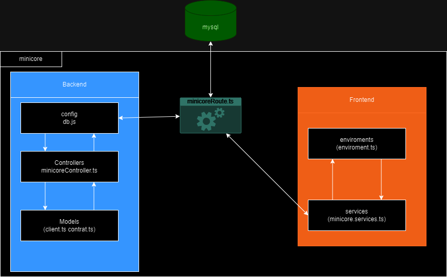

<h1 align="center"> Sobre Angular </h1>
<div style="display: flex; align-items: center;">
<br/>
<p align="justify"> Angular es un poderoso framework de desarrollo web front-end creado por Google. Con una arquitectura basada en componentes, Angular facilita la creación de aplicaciones web robustas y dinámicas. Su amplia comunidad y abundante documentación lo convierten en una elección popular para desarrolladores. Angular ofrece herramientas avanzadas para la gestión del estado, enrutamiento y comunicación con API, lo que lo convierte en una opción ideal para proyectos complejos. Además, su capacidad de renderización del lado del servidor (Server-Side Rendering) mejora la velocidad y la optimización de SEO de las aplicaciones web.</p>
</div>

<h1 align="center"> Sobre MySQL </h1>
<div style="display: flex; align-items: center;">
<br/>
<p align="justify">MySQL presenta algunas ventajas que lo hacen muy interesante para los desarrolladores. La más evidente es que trabaja con bases de datos relacionales, es decir, utiliza tablas múltiples que se interconectan entre sí para almacenar la información y organizarla correctamente. Al ser basada en código abierto es fácilmente accesible y la inmensa mayoría de programadores que trabajan en desarrollo web han pasado usar MySQL en alguno de sus proyectos porque al estar ampliamente extendido cuenta además con una ingente comunidad que ofrece soporte a otros usuarios.</p>
</div>

<h1 align="center"> Diseño de Ingenieria </h1>
<div>
<b>Arquitectura de la aplicación:</b><br/><br/>
<br/>
<p align="justify">La aplicación de contratos de un cliente funciona con una base de datos mysql que esta configurada dentro del backend con .js y en el contrador hace el calculo del monto total en base a la informacion definida en los archivps del modelo (client.ts y contrat.td), del lado de front la aplicación predefine el ambiente del back para llamarlo y en los servicios recoge la información para ser mostrada
</p>
</div>

# Pasos para ejecución local:
1. Clonar el proyecto en Github CLI con el comando: ```gh repo clone fabiliria280802/minicore-angular-mysql```
2. Se abren dos terminales de vs ```ctrl + shift + ñ``` una para correr el backend y otra para correr el frontend.
3. Levantar backend se usa el comando: ```npm run backend```
4. Luego para levantar la aplicación con el frontend se usa el comando: ```npm start```

Nota 1: si no tienes instalado npm ejecutar el comando ```npm install``` antes del paso 3 y 4.

Nota 2: el siguiente link es un video ilustrativo de la aplicación funcionando: https://clipchamp.com/watch/rTZkKGIb98O

Nota 3: el siguiente link es un video ilustrativo de la autenticación funcionando: https://clipchamp.com/watch/b6wW5rYEqXS

<h1 align="left"> Referencias Bibliográficas: </h1>

- Blanco, N. (2023, 25 mayo). ¿Qué patrón usa Angular? MVC o MVVM. OpenWebinars.net. https://openwebinars.net/blog/que-patron-usa-angular-mvc-o-mvvm/
- David. (2017). Explicación del patrón MVC en AngularJS. Guidacode. https://guidacode.com/2017/angularjs/explicacion-del-patron-mvc-en-angularjs/
- MA-NO Web Design and Development. (2020, 4 noviembre). El concepto de ModeloVistaControlador MVC explicado. https://www.ma-no.org/es/programacion/el-concepto-de-modelo-vista-controlador-mvc-explicado
- Mendoza, J. (2020, 20 octubre). ¿Qué es el patrón MVC? | Desarrollo de software. Desarrollo de software. https://desarrollodesoftware.co/que-es-el-patron-mvc.html
